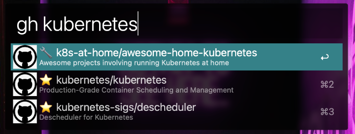

# [Alfred 4](https://www.alfredapp.com) Workflow to search through your maintained/watched/starred GitHub repositories.

# Setup
This workflow requires a number of Python modules. These can be installed by running the following command from your terminal:

`/usr/bin/pip3 install -r requirements.txt`

The workflow requires the `GITHUB_TOKEN` variable to be set to a Personal Access Token (PAT) that has permission to browse your repositories. See the [GitHub documentation](https://docs.github.com/en/authentication/keeping-your-account-and-data-secure/creating-a-personal-access-token) for more information on how to create a Personal Access Token.

# Usage

## Keywords

### `gh <query>`

Searches through your maintained/watched/starred GitHub repositories.

Selecting a record opens the selected repository in your default browser.

The results are cached on disk for 24 hours to prevent unnecessary requests to the GitHub API. 

#### Modifiers

* `Option key`: Opens the repository Issues page in your default browser.
* `Command key`: Opens the repository Pull Request page in your default browser.

### `ghupdate`

Forcibly updates the local cache.

#### Modifiers

N/A
